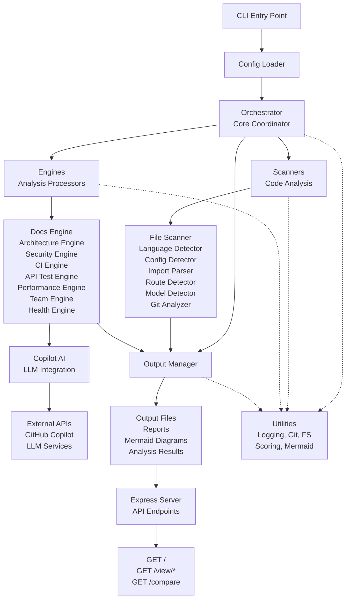
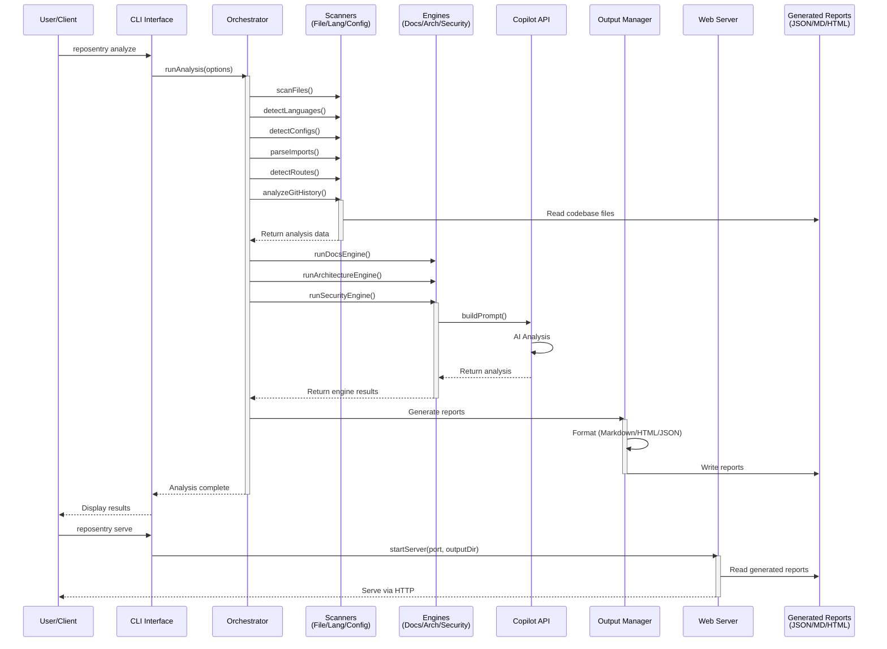
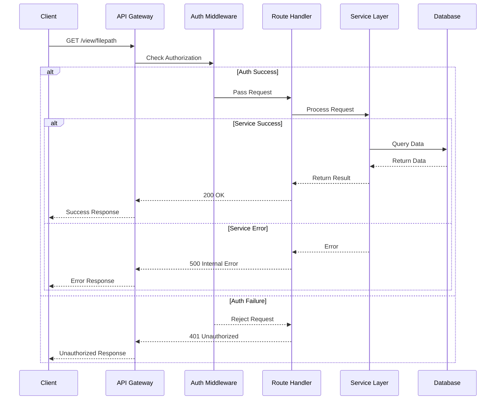

# # RepoSentry System Architecture

## Table of Contents
1. [Overview](#overview)
2. [High-Level Architecture](#high-level-architecture)
3. [Core Components](#core-components)
4. [Analysis Engines](#analysis-engines)
5. [Scanners & Detectors](#scanners--detectors)
6. [Data Flow](#data-flow)
7. [Key Design Decisions](#key-design-decisions)
8. [Component Locations](#component-locations)

---

## Overview

RepoSentry is an **AI-powered codebase intelligence platform** that automatically analyzes Git repositories and generates comprehensive documentation, architecture diagrams, security audits, CI/CD pipelines, performance reports, and team collaboration templates.

**Architecture Type:** Modular, pipeline-based system with pluggable analysis engines
**Technology Stack:** TypeScript, Express.js, Node.js ≥ 18
**Entry Point:** CLI with interactive mode and command-driven analysis
**Output:** Markdown, HTML, and JSON formats

---

## High-Level Architecture

```
┌─────────────────────────────────────────────────────────────────────┐
│                         CLI Interface (commander)                   │
│     analyze | serve | badge | compare | init (interactive mode)    │
└────────────────────────┬────────────────────────────────────────────┘
                         │
                         ▼
┌─────────────────────────────────────────────────────────────────────┐
│                    Configuration Layer (cosmiconfig)                │
│      Loads: reposentry.config.js/json, package.json reposentry     │
└────────────────────────┬────────────────────────────────────────────┘
                         │
                         ▼
┌─────────────────────────────────────────────────────────────────────┐
│                     Orchestrator (runAnalysis)                      │
│  Coordinates scanning, engine execution, progress, output writing  │
└────────┬──────────────────┬─────────────────────┬──────────────────┘
         │                  │                     │
    ┌────▼────┐        ┌────▼─────┐      ┌───────▼──────┐
    │Scanners │        │ Engines  │      │Output Manager│
    └────┬────┘        └────┬─────┘      └───────┬──────┘
         │                  │                     │
    ┌────▼────────────┐ ┌────▼──────────────────┐│
    │ File Scanner    │ │ 8 Specialized        ││
    │ Language Detect │ │ Analysis Engines     ││
    │ Config Detector │ │ (Docs, Architecture, ││
    │ Import Parser   │ │  Security, CI, Tests,││
    │ Route Detector  │ │  Performance, Team,  ││
    │ Model Detector  │ │  Health)             ││
    │ Git Analyzer    │ └────┬──────────────────┘│
    └────────────────┘      │                    │
                            ▼                    ▼
                    ┌──────────────────┐ ┌──────────────┐
                    │ Copilot CLI      │ │ Output Files │
                    │ (AI Prompts)     │ │ (.reposentry)│
                    └──────────────────┘ └──────────────┘
                            │
                            ▼
                    ┌──────────────────┐
                    │ Express Server   │
                    │ (Preview/Serve)  │
                    └──────────────────┘
```

---

## Core Components

### 1. **CLI Layer** (`src/cli.ts`)
**Responsibility:** Command parsing and user interaction

- **Commands:**
  - `analyze` — Full or selective repository analysis
  - `serve` — Start preview server on port 3000
  - `badge` — Generate health score badge
  - `compare` — Compare scores across analysis runs
  - `init` — Interactive setup mode

- **Features:**
  - Uses Commander.js for CLI parsing
  - Supports interactive menu when no command given
  - Model selection for Copilot backend
  - Verbose logging and error handling

- **Location:** `src/cli.ts`

### 2. **Configuration System** (`src/config.ts`)
**Responsibility:** Loads and merges configuration from multiple sources

- **Sources (in order):**
  - `reposentry.config.js`
  - `reposentry.config.json`
  - `package.json` → `reposentry` field

- **Default Values:**
  ```typescript
  {
    output: '.reposentry',
    format: 'markdown',
    depth: 'standard',
    ignore: ['node_modules', 'dist'],
    engines: { docs, architecture, security, ci, apiTests, performance, team, health }
  }
  ```

- **Location:** `src/config.ts`

### 3. **Orchestrator** (`src/core/orchestrator.ts`)
**Responsibility:** Main analysis pipeline — coordinates all phases

**Phases:**
1. **Preflight Checks** — Git repo validation, Copilot availability
2. **Scanning Phase** — File collection, language/framework detection
3. **Deep Analysis Phase** — Parse imports, detect routes/models, analyze git history
4. **Engine Execution** — Run selected analysis engines sequentially
5. **Health Scoring** — Calculate grades and overall score
6. **Output Writing** — Persist results in chosen format
7. **Reporting** — Display summary and next steps

- **Key Outputs:**
  - `categories[]` — Score for each analysis category
  - `analysis.json` — Machine-readable results
  - Report files (markdown, HTML, or JSON)

- **Location:** `src/core/orchestrator.ts`

### 4. **Copilot Integration** (`src/core/copilot.ts`)
**Responsibility:** Interface with GitHub Copilot CLI for AI analysis

- **Functions:**
  - `isCopilotAvailable()` — Check if Copilot CLI is installed
  - `query(prompt, options)` — Send analysis prompt to Copilot
  - `getAvailableModels()` — Fetch available AI models
  - `setCopilotModel(model)` — Set global model for all calls

- **Fallbacks:**
  - If Copilot unavailable: returns placeholder results
  - Supports model override via `--model` flag
  - Retry logic with configurable delays

- **Location:** `src/core/copilot.ts`

### 5. **Output Manager** (`src/core/output-manager.ts`)
**Responsibility:** Handles file writing and format conversion

- **Formats:**
  - **Markdown** (default) — Human-readable, Git-friendly
  - **HTML** — Interactive browser view with Mermaid rendering
  - **JSON** — Machine-readable bundle + analysis data

- **Methods:**
  - `init()` — Create output directory structure
  - `writeFile(path, content, format)` — Write individual files
  - `finalize()` — Post-process and format conversion

- **Safety Features:**
  - Checks for existing files (respects `--force` flag)
  - Creates parent directories automatically
  - HTML escaping for security

- **Location:** `src/core/output-manager.ts`

### 6. **Prompt Builder** (`src/core/prompt-builder.ts`)
**Responsibility:** Constructs context-aware prompts for Copilot

- **Components:**
  - `PromptContext` — Project metadata (name, languages, frameworks, file tree)
  - `buildFileTree()` — Create directory structure for prompt
  - Per-engine prompt builders in `src/prompts/`

- **Supports:**
  - Dynamic prompt templating via Handlebars
  - Depth-aware context (quick/standard/deep)
  - Route/model/import information injection

- **Location:** `src/core/prompt-builder.ts`

### 7. **Progress Tracker** (`src/core/progress.ts`)
**Responsibility:** Display progress spinners and step tracking

- **Uses:** ora spinner library
- **Displays:** Engine progress, AI analysis status
- **Colored output:** Via chalk for terminal styling

- **Location:** `src/core/progress.ts`

---

## Analysis Engines

Each engine is a specialized analyzer that runs independently and returns structured results:

| Engine | File | Purpose | Output Files |
|--------|------|---------|--------------|
| **Docs** | `src/engines/docs-engine.ts` | Generate README, API docs, setup guides, contributing templates | README.md, API.md, SETUP.md, CONTRIBUTING.md, CHANGELOG.md, FAQ.md |
| **Architecture** | `src/engines/architecture-engine.ts` | Create Mermaid dependency graphs and system design docs | ARCHITECTURE.md, diagrams/*.mmd |
| **Security** | `src/engines/security-engine.ts` | Vulnerability scanning, threat modeling, security audit | security/SECURITY_AUDIT.md, security/VULNERABILITY_REPORT.md, security/threat-model.mmd |
| **CI** | `src/engines/ci-engine.ts` | Generate CI/CD pipelines, Docker configs, deployment guides | infrastructure/ci.yml, infrastructure/Dockerfile, infrastructure/docker-compose.yml |
| **API Tests** | `src/engines/api-test-engine.ts` | Create API test collections and documentation | testing/API_TESTS.md, testing/api-collection.json |
| **Performance** | `src/engines/performance-engine.ts` | Detect anti-patterns, identify bottlenecks | performance/PERFORMANCE_AUDIT.md |
| **Team** | `src/engines/team-engine.ts` | Generate PR/issue templates, code review guidelines | team/PR_TEMPLATE.md, team/ISSUE_TEMPLATE.md, team/CODEOWNERS |
| **Health** | `src/engines/health-engine.ts` | Calculate overall score and grade | HEALTH_REPORT.md, analysis.json, history.json |

**Engine Interface:**
```typescript
interface EngineResult {
  score: number;           // 0-100
  grade: 'A' | 'B' | 'C' | 'D' | 'F';
  details: string;         // Human-readable assessment
  files: Record<string, string>;  // Output files
}

async function runXxxEngine(
  inputs: EngineInput,
  outputManager: OutputManager,
  progress: Progress
): Promise<EngineResult>
```

---

## Scanners & Detectors

These utilities analyze the codebase to extract metadata:

| Scanner | File | Purpose | Output |
|---------|------|---------|--------|
| **File Scanner** | `src/scanners/file-scanner.ts` | Recursively scan project for files, respect gitignore | `files[]`, `totalFiles`, `directories` |
| **Language Detector** | `src/scanners/language-detector.ts` | Identify programming languages, frameworks, package manager | `languages[]`, `frameworks[]`, `runtime`, `packageManager` |
| **Config Detector** | `src/scanners/config-detector.ts` | Find config files (package.json, tsconfig.json, etc.) | `hasEnvFile`, `hasGitignore`, `hasDockerfile`, `hasCIConfig` |
| **Import Parser** | `src/scanners/import-parser.ts` | Parse import/require statements to build dependency graph | `imports: Map<file, imports[]>` |
| **Route Detector** | `src/scanners/route-detector.ts` | Identify API routes and endpoints | `routes: Array<{method, path, file}>` |
| **Model Detector** | `src/scanners/model-detector.ts` | Find database models (Prisma, TypeORM, Mongoose, etc.) | `models: Array<{name, file, type}>` |
| **Git Analyzer** | `src/scanners/git-analyzer.ts` | Extract commit history, contributors, tags | `commits[]`, `contributors[]`, `tags[]`, `recentCommits[]` |

---

## Data Flow

### Full Analysis Flow (High-Level)

```
User runs: reposentry analyze [options]
              │
              ▼
       Load Config (cosmiconfig)
              │
              ▼
    Initialize Orchestrator
              │
    ┌─────────┴──────────┐
    │                    │
    ▼                    ▼
 Scanners          Validation
    │               (Git check,
    │               Copilot check)
    │                    │
    └─────────┬──────────┘
              │
              ▼
    Collect Metadata:
    - Files, languages, frameworks
    - Imports, routes, models
    - Git history, contributors
              │
              ▼
    Initialize OutputManager
              │
              ▼
    For Each Engine (Sequential):
      │
      ├─ Build prompt from metadata
      │
      ├─ Call Copilot CLI with prompt
      │
      ├─ Parse response
      │
      ├─ Write output files
      │
      └─ Update progress + score
              │
              ▼
    Calculate Overall Score & Grade
              │
              ▼
    Generate Report Summary
              │
              ▼
    Display Results & Next Steps
```

### Engine Execution Detail

**For each engine:**

1. **Preparation Phase**
   - Build engine-specific prompt from context
   - Gather relevant files/metadata
   - Create progress tracker

2. **AI Analysis Phase**
   - Format prompt using Handlebars templates
   - Send to Copilot CLI (or fallback if unavailable)
   - Parse structured response

3. **Output Generation Phase**
   - Write markdown/HTML/JSON files
   - Create diagrams if applicable (Mermaid)
   - Update file metadata

4. **Scoring Phase**
   - Extract score from AI analysis
   - Convert to 0-100 grade
   - Append to categories array

---

## Key Design Decisions

### 1. **Modular Engine Architecture**
- **Decision:** Each analysis domain (docs, security, CI, etc.) is a separate engine
- **Rationale:** 
  - Allows independent execution
  - Easy to disable specific analyses
  - Enables future extensibility
  - Developers can understand engines in isolation

### 2. **Pipeline-Based Orchestration**
- **Decision:** Sequential phase execution (scan → analyze → output → score)
- **Rationale:**
  - Clear separation of concerns
  - Phases build on previous results
  - Simple error handling per phase
  - Predictable execution order

### 3. **Copilot CLI as AI Backend**
- **Decision:** Invoke `copilot` command via shell for AI analysis
- **Rationale:**
  - Avoids dependency on proprietary APIs
  - Users control their own auth/models
  - Fallback to placeholder results works
  - Supports multiple AI backends long-term

### 4. **Flexible Output Formats**
- **Decision:** Support markdown, HTML, and JSON simultaneously
- **Rationale:**
  - Markdown = Git-friendly, version control
  - HTML = Interactive preview with diagrams
  - JSON = Automation and CI/CD integration
  - OutputManager abstracts format differences

### 5. **Cosmiconfig for Configuration**
- **Decision:** Use cosmiconfig for config file discovery
- **Rationale:**
  - Standard practice in npm ecosystem
  - Supports multiple config formats
  - Falls back to defaults gracefully
  - Users can config via package.json

### 6. **Commander.js CLI Framework**
- **Decision:** Use commander for argument parsing
- **Rationale:**
  - Industry standard for Node.js CLIs
  - Built-in help and version support
  - Subcommand support
  - Easy option parsing

### 7. **Synchronous File Operations with Error Handling**
- **Decision:** Validate files before analysis, handle gitignore
- **Rationale:**
  - Prevents noise from build artifacts
  - Respects developer intent
  - Improves AI analysis quality
  - Saves API calls on ignored files

### 8. **Progress Tracking with Spinners**
- **Decision:** Use `ora` library for visual progress feedback
- **Rationale:**
  - Users know system is working (analysis takes 30-60s per engine)
  - Clear step-by-step progress
  - Verbose mode for debugging
  - Better UX than silent processing

### 9. **Score Calculation & Grading**
- **Decision:** Combine engine scores into overall grade (A-F)
- **Rationale:**
  - Gives quantifiable codebase health metric
  - Tracks progress over time (history.json)
  - Enables badges and reports
  - Motivates improvements

### 10. **Dry-Run Validation (No Copilot Required)**
- **Decision:** All scanning/file work happens without Copilot; only analysis calls it
- **Rationale:**
  - System works without AI backend
  - Can preview file discovery before analysis
  - Easier debugging of file scanning issues
  - Reduces Copilot API calls in dry runs

---

## Component Locations

### Entry Points
- **CLI Entry:** `src/index.ts` → `src/cli.ts`
- **Main Analysis:** `src/core/orchestrator.ts` → `runAnalysis()`
- **Server Preview:** `src/server/index.ts` → `startServer()`

### Core Analysis Logic
```
src/core/
├── orchestrator.ts      ← Main analysis pipeline
├── copilot.ts          ← AI backend integration
├── prompt-builder.ts   ← Prompt construction
├── output-manager.ts   ← File output handling
└── progress.ts         ← Progress tracking
```

### Analysis Engines
```
src/engines/
├── docs-engine.ts           ← Documentation generation
├── architecture-engine.ts   ← Architecture & dependency diagrams
├── security-engine.ts       ← Security audit & threat model
├── ci-engine.ts            ← CI/CD pipeline generation
├── api-test-engine.ts      ← API test collection creation
├── performance-engine.ts   ← Performance anti-pattern detection
├── team-engine.ts          ← Team collaboration templates
└── health-engine.ts        ← Overall health scoring
```

### Scanners & Utilities
```
src/scanners/
├── file-scanner.ts         ← File discovery
├── language-detector.ts    ← Language & framework detection
├── config-detector.ts      ← Config file detection
├── import-parser.ts        ← Dependency graph extraction
├── route-detector.ts       ← API route detection
├── model-detector.ts       ← Database model detection
└── git-analyzer.ts         ← Git history analysis

src/utils/
├── fs.ts                   ← Filesystem utilities
├── git.ts                  ← Git command wrappers
├── logger.ts               ← Logging with colors
├── mermaid.ts              ← Mermaid diagram generation
├── scoring.ts              ← Grade calculation
└── version.ts              ← Version management
```

### Prompt Templates
```
src/prompts/
├── docs.prompts.ts         ← Documentation prompts
├── architecture.prompts.ts ← Architecture prompts
├── security.prompts.ts     ← Security prompts
├── ci.prompts.ts          ← CI/CD prompts
├── api-test.prompts.ts    ← API test prompts
├── performance.prompts.ts ← Performance prompts
├── team.prompts.ts        ← Team template prompts
└── health.prompts.ts      ← Health scoring prompts
```

### Server & Web UI
```
src/server/
└── index.ts                ← Express preview server with HTML UI
```

### Configuration
```
src/
├── config.ts               ← Configuration loading (cosmiconfig)
└── index.ts                ← CLI entry point
```

### Tests
```
tests/
├── core/
│   ├── git.test.ts
│   ├── mermaid.test.ts
│   ├── output-manager.test.ts
│   ├── prompt-builder.test.ts
│   └── scoring.test.ts
└── scanners/
    ├── config-detector.test.ts
    ├── file-scanner.test.ts
    └── language-detector.test.ts
```

---

## API Routes (Express Server)

The preview server (`src/server/index.ts`) exposes:

```
GET /                    → HTML directory listing of reports
GET /view/*filepath      → Render markdown/HTML for a report file
GET /compare             → JSON with score history and comparison data
```

---

## Execution Context

- **Runtime:** Node.js ≥ 18 (ES modules)
- **Build:** TypeScript → JavaScript via tsup
- **Package Manager:** npm
- **Dependencies:** See package.json (commander, chalk, express, glob, simple-git, etc.)
- **Type Safety:** TypeScript strict mode with tsconfig.json

---

## Summary

RepoSentry is a **modular, pipeline-based AI analysis platform** that:

1. **Scans** your repository structure, languages, and metadata
2. **Orchestrates** sequential execution of 8 specialized analysis engines
3. **Leverages** GitHub Copilot CLI for AI-powered insights
4. **Outputs** professional reports in markdown, HTML, and JSON
5. **Scores** your codebase health with quantified grades
6. **Serves** reports via an interactive web UI

The architecture prioritizes **modularity**, **extensibility**, and **fallback behavior** (works without Copilot) while maintaining **clear separation of concerns** across scanners, engines, and output management.

---

## System Architecture



---

## Data Flow



---

## Dependency Graph

```mermaid
flowchart LR
    subgraph CLI["CLI Entry"]
        index["index.ts"]
        cli["cli.ts"]
    end
    
    subgraph CONFIG["Config"]
        config["config.ts"]
    end
    
    subgraph CORE["Core"]
        orch["orchestrator.ts"]
        copilot["copilot.ts"]
        outmgr["output-manager.ts"]
        progress["progress.ts"]
        prompt["prompt-builder.ts"]
    end
    
    subgraph SCANNERS["Scanners"]
        filescan["file-scanner.ts"]
        langdetect["language-detector.ts"]
        cfgdetect["config-detector.ts"]
        impparse["import-parser.ts"]
        routedetect["route-detector.ts"]
        modeldetect["model-detector.ts"]
        gitanalyze["git-analyzer.ts"]
    end
    
    subgraph ENGINES["Engines"]
        doceng["docs-engine.ts"]
        archeng["architecture-engine.ts"]
        seceng["security-engine.ts"]
        cieng["ci-engine.ts"]
        apieng["api-test-engine.ts"]
        perfeng["performance-engine.ts"]
        teameng["team-engine.ts"]
        healtheng["health-engine.ts"]
    end
    
    subgraph PROMPTS["Prompts"]
        docprompt["docs.prompts.ts"]
        archprompt["architecture.prompts.ts"]
        secprompt["security.prompts.ts"]
        ciprompt["ci.prompts.ts"]
        apiprompt["api-test.prompts.ts"]
        perfprompt["performance.prompts.ts"]
        teamprompt["team.prompts.ts"]
        healthprompt["health.prompts.ts"]
    end
    
    subgraph UTILS["Utils"]
        fs["fs.ts"]
        git["git.ts"]
        logger["logger.ts"]
        mermaid["mermaid.ts"]
        scoring["scoring.ts"]
        version["version.ts"]
    end
    
    index --> cli
    cli --> orch
    cli --> config
    cli --> version
    
    orch --> copilot
    orch --> outmgr
    orch --> prompt
    orch --> progress
    orch --> filescan
    orch --> langdetect
    orch --> cfgdetect
    orch --> impparse
    orch --> routedetect
    orch --> modeldetect
    orch --> gitanalyze
    orch --> doceng
    orch --> archeng
    orch --> seceng
    orch --> cieng
    orch --> apieng
    orch --> perfeng
    orch --> teameng
    orch --> healtheng
    orch --> scoring
    orch --> logger
    orch --> version
    
    copilot --> logger
    
    outmgr --> fs
    outmgr --> logger
    outmgr --> version
    
    progress --> logger
    
    apieng --> copilot
    apieng --> outmgr
    apieng --> prompt
    apieng --> progress
    apieng --> routedetect
    
    archeng --> copilot
    archeng --> outmgr
    archeng --> prompt
    archeng --> progress
    archeng --> mermaid
    archeng --> impparse
    archeng --> modeldetect
    archeng --> routedetect
    
    cieng --> copilot
    cieng --> outmgr
    cieng --> prompt
    cieng --> progress
    cieng --> fs
    
    doceng --> copilot
    doceng --> outmgr
    doceng --> prompt
    doceng --> progress
    doceng --> docprompt
    doceng --> routedetect
    
    healtheng --> copilot
    healtheng --> outmgr
    healtheng --> prompt
    healtheng --> progress
    healtheng --> scoring
    healtheng --> healthprompt
    healtheng --> fs
    
    perfeng --> copilot
    perfeng --> outmgr
    perfeng --> prompt
    perfeng --> progress
    perfeng --> fs
    perfeng --> perfprompt
    
    seceng --> copilot
    seceng --> outmgr
    seceng --> prompt
    seceng --> progress
    seceng --> fs
    
    teameng --> copilot
    teameng --> outmgr
    teameng --> prompt
    teameng --> progress
    teameng --> gitanalyze
    
    apiprompt --> prompt
    archprompt --> prompt
    ciprompt --> prompt
    docprompt --> prompt
    healthprompt --> prompt
    perfprompt --> prompt
    secprompt --> prompt
    teamprompt --> prompt
    
    filescan --> fs
    cfgdetect --> fs
    impparse --> fs
    langdetect --> fs
    modeldetect --> fs
    routedetect --> fs
    
    gitanalyze --> git
```



---

## Database Schema

```mermaid
The project does NOT have traditional database tables or persistent data models. Instead, it has data structures and interfaces for in-memory analysis results. However, since you've requested an ER diagram and the project uses some form of data structures that represent entities (like analysis results, scores, git data, etc.), I'll create a diagram based on the logical data relationships found in the codebase.

erDiagram
    ANALYSIS ||--o{ SCORE_CATEGORY : contains
    ANALYSIS ||--o{ GIT_ANALYSIS : includes
    ANALYSIS ||--o{ SCAN_RESULT : from
    SCAN_RESULT ||--o{ FILE_EXTENSION : tracks
    GIT_ANALYSIS ||--o{ CONTRIBUTOR : has
    GIT_ANALYSIS ||--o{ GIT_COMMIT : contains
    GIT_ANALYSIS ||--o{ DIRECTORY_OWNERSHIP : maps
    SCAN_RESULT ||--o{ MODEL_INFO : detects
    MODEL_INFO ||--o{ MODEL_FIELD : contains
    SCAN_RESULT ||--o{ ROUTE_INFO : finds
    SCAN_RESULT ||--o{ IMPORT_INFO : parses
    IMPORT_INFO ||--o{ DEPENDENCY : lists
    OUTPUT ||--o{ HEALTH_REPORT : generates
    HEALTH_REPORT ||--o{ SCORE_CATEGORY : contains
    HEALTH_REPORT ||--o{ HISTORY_ENTRY : tracks
    ENGINE ||--o{ OUTPUT : produces

    ANALYSIS {
        string projectName
        string[] languages
        string[] frameworks
        string packageManager
        string cwd
        string outputDir
        string format
        string depth
    }

    SCORE_CATEGORY {
        string name
        number score
        string grade
        string details
    }

    GIT_ANALYSIS {
        array contributors
        array recentCommits
        number totalCommits
        array tags
        array activeBranches
        string firstCommitDate
        string lastCommitDate
    }

    CONTRIBUTOR {
        string name
        number commits
    }

    GIT_COMMIT {
        string hash
        string message
        string author
        string date
    }

    DIRECTORY_OWNERSHIP {
        string directory
        string contributor
    }

    SCAN_RESULT {
        array files
        number totalFiles
        map extensions
        set directories
    }

    FILE_EXTENSION {
        string extension
        number count
    }

    MODEL_INFO {
        string name
        string file
        string orm
        array fields
    }

    MODEL_FIELD {
        string name
        string type
        string description
    }

    ROUTE_INFO {
        string method
        string path
        string file
        string handler
        array middleware
    }

    IMPORT_INFO {
        string file
        array imports
    }

    DEPENDENCY {
        string name
        string version
        string scope
    }

    OUTPUT {
        string baseDir
        string format
        boolean force
        array filesWritten
    }

    HEALTH_REPORT {
        number overallScore
        string overallGrade
        string analyzedAt
        array categories
    }

    HISTORY_ENTRY {
        string analyzedAt
        number overallScore
        string overallGrade
        array categories
    }

    ENGINE {
        string name
        string type
        string status
    }
```

---

## API Request Flow


