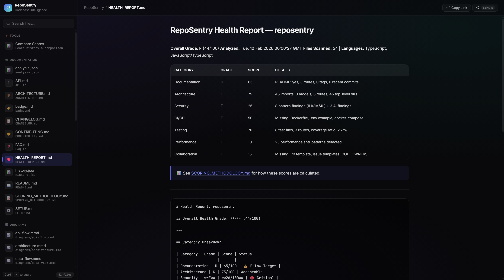
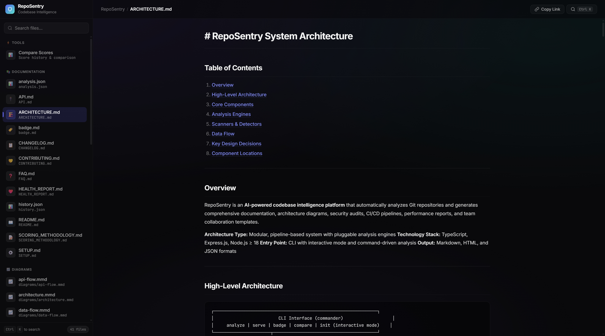
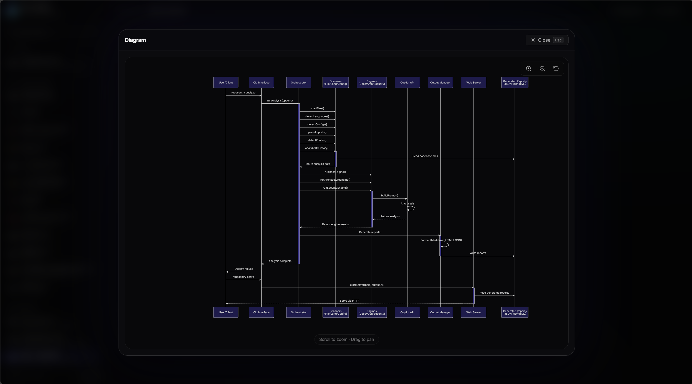
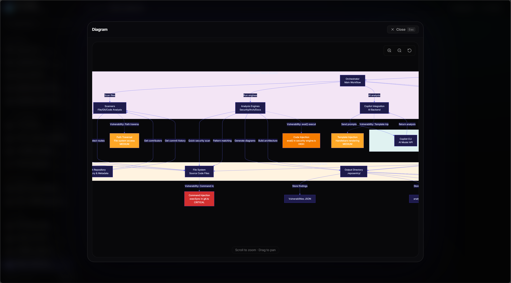
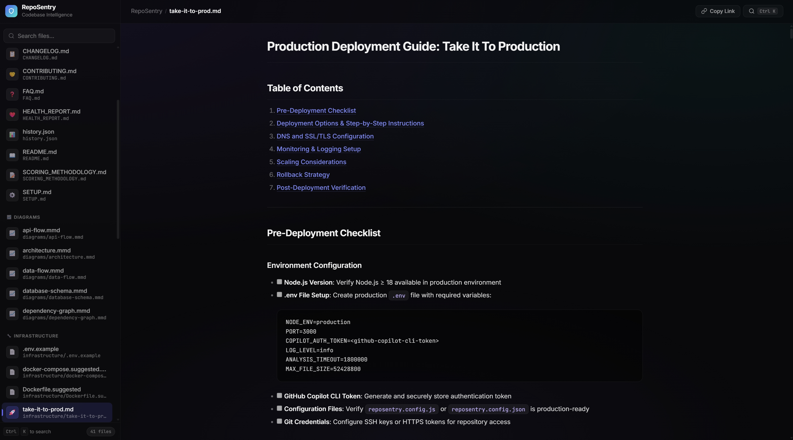

<div align="center">

# RepoSentry

**AI-powered codebase intelligence (docs, diagrams, security, CI/CD)**

Analyze any project and generate production-ready docs, architecture diagrams, security audits, CI/CD suggestions, tests, and a health grade — powered by GitHub Copilot CLI.

[DEV.to challenge post](https://dev.to/check__/reposentry-ai-codebase-intelligence-docs-diagrams-security-ci-built-with-copilot-cli-3ghm) • [npm](https://www.npmjs.com/package/reposentry) • [GitHub](https://github.com/MaheshDoiphode/reposentry)

[](LICENSE)
[](https://nodejs.org)
[](https://www.typescriptlang.org)

</div>

---

## What It Does

Point RepoSentry at any codebase and it generates a full intelligence report:

| Engine | What you get |
|--------|-------------|
| **Documentation** | README, API docs, Setup guide, Contributing guide, Changelog, FAQ |
| **Architecture** | Mermaid diagrams, dependency graphs, component maps |
| **Security** | Vulnerability scan, threat model |
| **CI/CD** | Pipeline + infra suggestions |
| **Testing** | API test collection, HTTP templates, Postman export |
| **Performance** | Anti-pattern detection |
| **Collaboration** | PR templates, issue templates, CODEOWNERS, onboarding *(git repos only)* |
| **Health Report** | Weighted score, letter grade, trend tracking |

---

## Quick Start

```bash
# Install from npm
npm i -g reposentry

# Instant demo (no analysis needed)
# This repo includes a pre-generated .reposentry/ output so you can preview immediately.
git clone https://github.com/MaheshDoiphode/reposentry.git
cd reposentry
reposentry serve
# open http://localhost:3000

# (or) install from source
# git clone https://github.com/MaheshDoiphode/reposentry.git
# cd reposentry
# npm install && npm run build && npm link

# Faster runs: target specific engines (recommended for first try)
cd path/to/any-repo
reposentry analyze --docs --architecture --health --depth quick --force
reposentry serve
# open http://localhost:3000
```

> **Requires:** Node.js ≥ 18 • [GitHub Copilot CLI](https://docs.github.com/en/copilot/how-tos/set-up/install-copilot-cli) (requires active Copilot subscription)
>
> First time? Run `copilot` once to authenticate via `/login`, or set `GH_TOKEN` with a [PAT](https://github.com/settings/personal-access-tokens/new) that has "Copilot Requests" permission.

---

## Commands

```bash
reposentry                  # Interactive mode — pick what to do
reposentry analyze          # Full analysis → .reposentry/
reposentry fix              # Auto-fix detected issues (missing LICENSE, CI, etc.)
reposentry compare          # Compare scores across analysis runs
reposentry serve            # Preview reports at localhost:3000
reposentry badge            # Generate shields.io health badge
reposentry init             # Interactive setup wizard
```

### Key Flags

```bash
reposentry analyze --docs --security  # Run specific engines only
reposentry analyze --all              # Override config, run everything
reposentry analyze --depth deep       # Thorough analysis
reposentry analyze --format json      # Machine-readable output
reposentry analyze --model <model>    # Pick Copilot model
reposentry analyze --force            # Overwrite existing output
reposentry analyze --ignore "dist/**" # Skip patterns
```

---

## Screenshots

RepoSentry includes a preview UI (`reposentry serve`) so you can browse every generated report.

### Full analysis run

<div align="center">

</div>

### Copilot-powered fixes

<div align="center">

</div>

<div align="center">

</div>

### Health report

<div align="center">

</div>

### Architecture (report + diagram)

<div align="center">

</div>

<div align="center">

</div>

### Threat model diagram

<div align="center">

</div>

### Production guide

<div align="center">

</div>

---

## Configuration

Optional — works out of the box. Create `reposentry.config.js` or add to `package.json`:

```js
// reposentry.config.js
export default {
  output: '.reposentry',
  depth: 'standard',
  engines: { docs: true, security: true, ci: true },
  ignore: ['node_modules', 'dist'],
};
```

---

## Score History & Comparison

Every `reposentry analyze` saves scores to a persistent history. Run `reposentry compare` to see how your project has improved over time — per-category breakdown with trend arrows.

Preview reports in the browser with `reposentry serve`, including an interactive score comparison view.

---

## Requirements

- **Node.js** ≥ 18
- **GitHub Copilot CLI** — requires an active [Copilot subscription](https://github.com/features/copilot/plans)
  - Install: `npm i -g @github/copilot` or `winget install GitHub.Copilot` or `brew install copilot-cli`
  - Auth: run `copilot` and use `/login`, or set `GH_TOKEN`/`GITHUB_TOKEN` env var
- Works on **git repos** and **non-git projects** (collaboration analysis requires git)

---

## Development

```bash
npm install        # Install dependencies
npm run build      # Build
npm run dev        # Watch mode
npm test           # Run tests (vitest)
```

---

## License

MIT © RepoSentry Contributors
